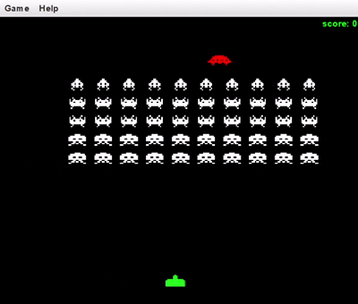

# Space Invaders 🎮

A Java-based Space Invaders remake built using Java Swing. The project demonstrates object-oriented programming, GUI development, keyboard input, timers, collision detection, and dynamic game-state updates.

## Overview

This project recreates the classic Space Invaders gameplay experience. The player controls a base at the bottom of the screen and uses missiles to destroy waves of incoming invaders.

The game includes:

- Player-controlled base movement
- Left and right keyboard controls
- Missile firing
- Multiple types of invaders
- Invader movement and direction changes
- Invader collision detection
- A moving mystery ship
- A dynamic scoreboard
- Different point values for different invader types
- Real-time game updates using a Java Swing timer

## Technologies Used

- **Java**
- **Java Swing**
- **Java AWT**
- `JPanel`
- `JFrame`
- `Timer`
- `Graphics2D`
- Keyboard event handling
- Object-oriented programming

## Project Structure

The game is separated into individual classes for the different game components:

```text
SpaceInvaders/
├── Panel.java
├── Base.java
├── Missile.java
├── Mystery.java
├── InvaderTop.java
├── InvaderMiddle.java
└── InvaderBottom.java
```

## Main Components

**`Panel.java`**

Acts as the main game panel. It manages the game loop, keyboard input, game objects, collision detection, and drawing.

**`Base.java`**

Represents the player's base and handles player movement and missile firing.

**`Missile.java`**

Represents the projectile fired by the player's base.

**`InvaderTop.java`**

Represents the top row of invaders and defines their point value and movement behavior.

**`InvaderMiddle.java`**

Represents the middle rows of invaders.

**`InvaderBottom.java`**

Represents the bottom rows of invaders and their associated point values.

**`Mystery.java`**

Represents the mystery ship that moves across the top of the screen.

## Controls

| Key | Action |
|---|---|
| `←` | Move base left |
| `→` | Move base right |
| `Space` | Fire missile |

## How It Works

The game uses a `javax.swing.Timer` as the main game loop. The timer repeatedly updates the game state and calls `repaint()` to redraw the panel.

The game loop handles:

1. Moving missiles
2. Moving the player's base
3. Moving the invaders
4. Checking for missile collisions
5. Updating the player's score
6. Moving the mystery ship
7. Redrawing the game

### Collision Detection

When a missile overlaps an invader, the invader is marked as hit and the missile is removed. The player's score is then increased based on the type of invader that was destroyed.

For example:

```java
scoreAmt += invader.getPoints();
```
The scoreboard is displayed using a Swing JLabel and updated when the player's score changes.

## Running the Project

1. Clone or download the repository.
2. Open the project in a Java-compatible IDE such as Eclipse or Visual Studio Code.
3. Make sure a compatible Java Development Kit (JDK) is installed.
4. Compile the project.
5. Run the class containing the game's main() method.
6. Use the arrow keys and spacebar to play.

## Demo



## Key Learning Objectives

- Java object-oriented programming
- GUI programming with Swing
- Event-driven programming
- Keyboard input handling
- Game loops and timers
- Collision detection
- ArrayLists and object management
- Custom graphics using Graphics2D
- Managing and updating application state
